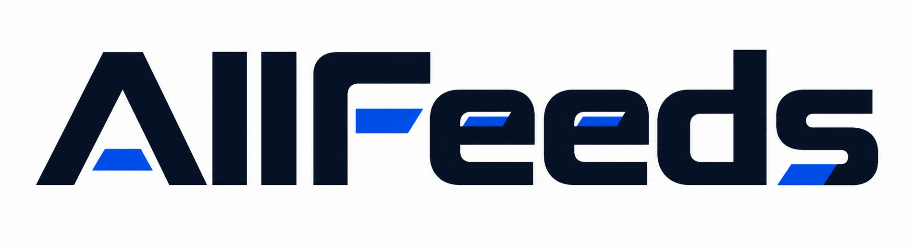

Open-source configuration and release checks: [release guide](../docs/open-source.md).

> This repository includes the Genchi activity catalog and notification product. See [Genchi v2 operations](../docs/product-v2.md). The framework reference below describes the inherited AllFeeds runtime.

Genchi now answers event questions from its catalogue and selects show and ticket-deadline countdowns daily. Free Q&A allows one question per hour shared by all users. See [feature details](../docs/home-assistant.md).

  

# AllFeeds

> One distributed crawler for every kind of source.

English | [简体中文](README_ZH.md) | [Gitee](https://gitee.com/StarSailAI/allfeeds)

## One crawler. Any source. Any scale.

Fetching one page is easy. Keeping hundreds of sources fresh, recovering failed
jobs, replaying history and adding capacity without downtime is the hard part.

AllFeeds is a distributed collection system for websites, RSS feeds, JSON APIs,
sitemaps and custom data sources. It gives every job a place in a visible task
pool, sends work to compatible Workers, and turns collected content into
consistent Resources.

Start with a Controller and Worker on one machine. When work piles up, connect
another Worker and let it help immediately.

## What can you build with it?

- A continuously updated news, research or market-data pipeline.
- A web archive that keeps both the latest Resource and its revision history.
- A large historical backfill that can be paused, resumed and scaled out.
- A private collection cluster with different Workers for different source types.
- A crawler platform where new Fetchers are installed as plugins instead of
  being wired into the scheduler.

AllFeeds includes ready-to-use Fetchers for RSS, web pages, list/detail sites,
JSON APIs and sitemaps. Fetcher, Sink and Asset Store plugins let the same
framework grow into domain-specific systems.

## Why is AllFeeds designed this way?

### Registration and execution should evolve independently

Schedules answer **what should run and when**. Workers answer **where and how it
runs**. Keeping those decisions separate means changing a schedule never depends
on a machine, and adding a machine never changes the schedule.

### A machine should be capacity, not configuration

Workers advertise their queues, plugins and available slots. The Controller only
assigns compatible tasks. A small resident machine can handle normal traffic;
a temporary 24-core machine can join later and accelerate the same queue without
moving data or rewriting jobs.

### New sources should not make the core more complicated

A Fetcher is an installable Python plugin with a validated configuration and a
stable output contract. The scheduler does not need source-specific code, so the
platform remains understandable as the number of integrations grows.

### Failure should be visible and recoverable

Every task has priority, attempts, timeout, lease and execution history. Transient
failures can return to the pool with a delay; permanent failures remain visible
for an operator. PostgreSQL is the shared source of truth, so queue state can be
inspected and audited directly.

### Collection should be safe to repeat

Distributed systems deliver work at least once. AllFeeds embraces that reality:
lease tokens reject late results, while the PostgreSQL Sink uses stable source
IDs to make repeated writes idempotent and preserve content revisions.

## What does this architecture give you?

| Situation | What you do | What AllFeeds provides |
| --- | --- | --- |
| Normal daily collection | Keep one resident Worker online | Predictable resource use and continuous schedules |
| A sudden queue spike | Start another Worker | New capacity joins the existing pool immediately |
| A large historical replay | Create a Backfill batch | Windowed, parallel, pausable work |
| An unstable upstream | Configure retry and concurrency limits | Controlled pressure, delayed retries and dead-letter history |
| A new kind of source | Install a Fetcher plugin | Capability-based routing without changing the Controller |
| Day-to-day operations | Open the Dashboard | Live Workers, queues, errors, history and data freshness |

## Built to be operated

A crawler is only useful when people can tell whether it is working. The
read-only operations dashboard keeps running tasks, waiting work, errors,
execution summaries, schedules and Worker capacity in one place.

## A simple mental model

~~~text
Sources and Backfills
        |
        v
Controller -> PostgreSQL Task Pool -> Workers
                                      |
                                      v
                           Fetcher -> Resource -> Sink
~~~

The Controller coordinates. Workers execute. Plugins collect. PostgreSQL keeps
the truth.

## Start small. Scale when you need it.

~~~bash
python3 scripts/init-local-env.py
docker compose up -d --build postgres control dashboard
~~~

Add the first Source, enroll a Worker, and AllFeeds is ready to collect.

- [Deployment](../docs/deployment.md)
- [Plugin development](../docs/plugin-development.md)
- [Architecture](../docs/architecture.md)
- [Agent development guide](../AGENTS.md)

## Extend AllFeeds with your Agent

AllFeeds includes an Agent-ready development guide covering its architecture,
contracts, plugin interfaces and validation workflow. Open this repository with
your coding Agent and give it this instruction:

> Read `AGENTS.md` in full first. Understand AllFeeds' architecture, task
> lifecycle, plugin contracts and development rules, then help me implement:
> **describe your requirement here**.

For most users, this is the most direct way to extend AllFeeds: describe the
outcome you need, then let your Agent implement and verify it against the
project's rules.

[MIT License](../LICENSE)
